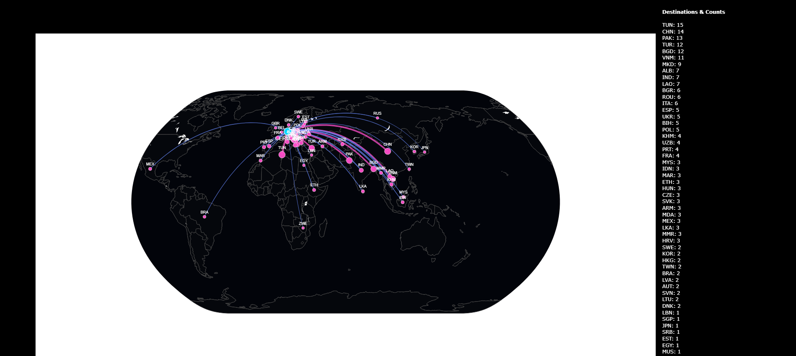
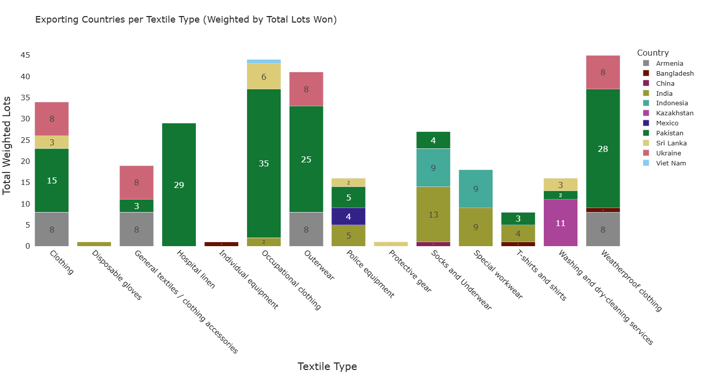
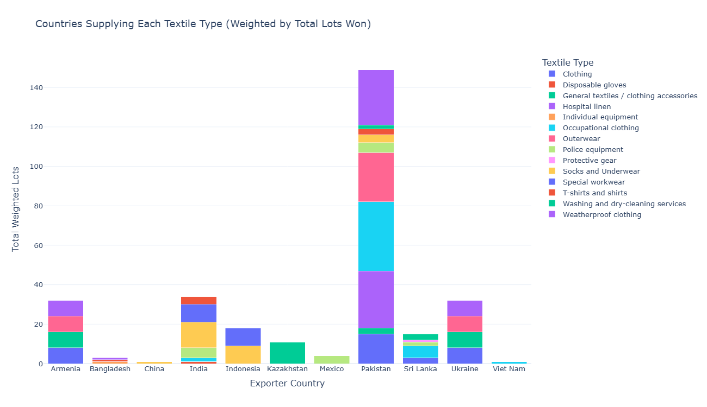
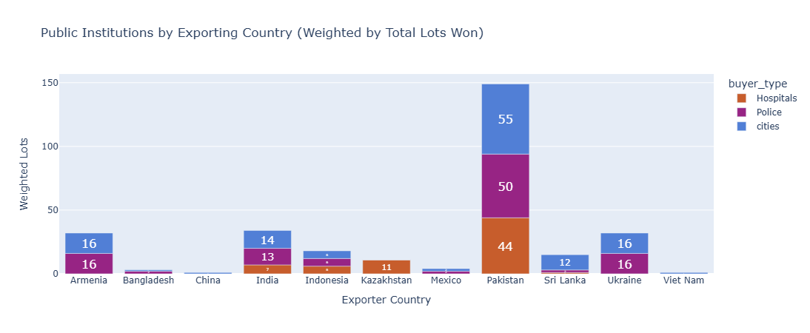

# 🌍 Public Procurement Supply Chain Mapping: Fair, Transparent, and Digital

## Overview

This project investigates the global production origins of textiles (such as hospital linens, occupational uniforms, and protective workwear) purchased by German public authorities.

By combining European public tender registries with international customs shipment data, this analysis bypasses standard transparency limitations to map the hidden, macro-level geographic footprint of institutional supply chains.

## 🎯 Key Objectives

- **Data Quality Control:** Resolve systemic gaps in pre-eForms procurement databases by mining historical award notices.
- **Database Integration:** Merge separate, unstructured datasets (EU TED notices and Trade Atlas customs logs) to track the true origin of public goods.
- **Clear Reporting:** Transform complex geospatial and commercial data into intuitive, scannable visualizations for non-technical stakeholders.

## 🛠️ Tech Stack & Methodologies

- **Language:** Python
- **Data Manipulation:** `pandas`, `numpy` (Standardizing classifications, quantitative weighting)
- **Text Processing & Linkage:** `rapidfuzz`, `re` (Algorithmic fuzzy-matching, Regex for corporate name normalization)
- **Geospatial & Visualization:** `plotly`, `pycountry` (Interactive coordinate mapping, scatter-geo flow charts)

## 📊 Key Highlights & Technical Achievements

1. **Algorithmic Fuzzy-Matching:** Built custom Python scripts (`tools_data_cleaning.py`) to unify messy corporate names, stripping legal suffixes (e.g., "GmbH & Co. KG") and applying token-sort ratios to accurately link public contract winners to global import shipment records.
2. **Quantitative Weighting:** Segmented tender documents by standard EU product codes (CPV) using a custom weighted-lots formulation. This prevented small contracts from skewing the data, revealing accurate market dominance across different garment categories.
3. **Geospatial Clustering:** Extracted latitude and longitude coordinates from the Open Supply Hub (OSH) to group fragmented factory locations into clean, city-level production clusters across South and Southeast Asia.
4. **Time-Series Filtering:** Implemented a 180-day temporal validation filter to ensure customs shipments accurately aligned with the contract publication dates.

## 📁 Project Directory Structure

```text
ted-trade-pipeline/
├── .gitignore                           # Excludes local caches, heavy data inputs, and dynamic runtime metrics
├── README.md                            # Comprehensive project overview and replication documentation
├── config.py                            # Central workspace paths, date ranges, and target textile HS codes
├── requirements.txt                     # Fixed Python package and framework dependencies
│
├── data/
│   ├── raw_ted/                         # Source public contract awards from Tenders Electronic Daily
│   │   ├── TED_06-10-2025.csv
│   │   └── TED_Data_2018-2025_colored.xlsx
│   └── tradeatlas_files/                # Manual spreadsheet downloads pulled from TradeAtlas customs databases
│
├── notebooks/                           # Step-by-step ordered evaluation and analysis pipeline
│   ├── 01_clean_merge_ted_data.ipynb    # Aggregates raw public tenders, filters down to textiles, and handles split-row items
│   ├── 02_generate_tradeatlas_links.ipynb # URL-encodes target vendor roots and tariff profiles to facilitate scraping
│   ├── 03_process_tradeatlas_data.ipynb  # Unifies standalone log files into a consolidated trading history matrix
│   ├── 04_analysis_countries_of_origin.ipynb # Maps global logistics networks supplying public authorities (Generates HTML maps)
│   └── 05_analysis_textile_types.ipynb  # Applies token fuzz matching to isolate regional specialization trends
│
├── scripts/
│   ├── __init__.py                      # Registers scripts as an importable module
│   └── tools_data_cleaning.py           # Reusable data cleansing, date formatting, and text manipulation tools
│
└── outputs/                             # Dynamic analytics, cross-matched tables, and tracking files (Autogenerated)
    ├── df_all_matches.csv
    ├── germany_flows.html
    ├── matched_winners.csv
    ├── merged_tradeatlas_clean.xlsx
    ├── ted_only_selected_notices.xlsx
    ├── tradeatlas_links_first2words_20firms.csv
    └── winner_counts_only_selected_notices.csv
```

## 🖼️ Visual Highlights

### 1. Global Sourcing Flow Map


_Interactive flow map visualizing the volume of textile trade routes between Germany and manufacturing hubs._

### 2. Exporting Countries by Textile Type


_Stacked bar chart demonstrating the specific manufacturing hubs relied upon for specialized goods like hospital linens, occupational clothing, and weatherproof garments._

---

### 2. Market Sourcing Profiles by Country


_Stacked bar chart detailing the diverse product category breakdowns and manufacturing footprints across major international exporting countries._

---

### 3. Public Procurement Allocations by Public Institutions


_Stacked bar chart tracking the allocation of public tender volumes across vital end-use entities, including hospital infrastructure, municipal cities, and police forces._
